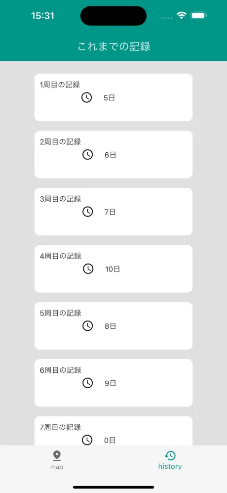

## 👤 自己紹介

現在AIエンジニアとして勤務していますが、個人でiOSアプリ・webアプリ開発にも力を入れており、複数のアプリを個人でリリースしています。

- 技術スタック: Flutter / Firebase / Python / HTML / CSS

# iOS App Portfolio

今までに開発したiOSアプリをまとめています。
個人開発の経験があり、UI/UXと設計の両方を意識して開発しています。
📱 [App Storeのリンク](https://apps.apple.com/us/developer/futa-arahori/id1688547044)
[その他](https://apps.apple.com/jp/app/%E3%83%A2%E3%83%B3%E3%82%B9%E3%82%BF%E3%83%BCtodo/id6444066369)

## 📱 主なアプリ一覧

| アプリ名 | 概要 |
|---------|------|
| [Schema　体重管理&共有アプリ](#Schema体重管理&共有アプリ) | 体重を友達と共有するSNS風アプリ |
| [琵琶湖一周歩数計](#琵琶湖一周歩数計) | 歩数に応じて琵琶湖一周できる歩数計アプリ |
| [HabitHeat](#HabitHeat) | 習慣の達成状況をカレンダー上のヒートマップで確認できるアプリ |

---

## 🟦 Schema　体重管理&共有アプリ

📱 [App Storeで見る](https://apps.apple.com/us/app/schema-%E4%BD%93%E9%87%8D%E7%AE%A1%E7%90%86-%E4%BD%93%E9%87%8D%E5%85%B1%E6%9C%89%E3%82%A2%E3%83%97%E3%83%AA/id6743387564)

### 📱 アプリ概要
- 体重を入力・記録し、相互フォローした友人と共有できるSNS風アプリ。
- データはFirebaseで管理し、リアルタイムで反映。
- グラフで体重の推移も表示可能。

### 🛠 使用技術

| 技術 | 用途 |
|------|------|
| Flutter | クロスプラットフォーム開発 |
| Firebase Authentication / Firestore | オンラインデータベース管理 |

### 🎥 スクリーンショット

  
  

### 🌟 工夫した点
- 電卓風UIでスムーズな体重入力が可能
- 相互フォロー型のプライバシー設計
- Firebaseでリアルタイム同期を実現

---

## 🏞 琵琶湖一周歩数計

琵琶湖を一周するウォーキングを体験できるiOSアプリです。iPhoneの歩数情報と連携し、実際の歩数に応じて「今どこまで歩いたか」が地図上で可視化されます。

📱 [App Storeで見る](https://apps.apple.com/us/app/%E7%90%B5%E7%90%B6%E6%B9%96%E4%B8%80%E5%91%A8%E6%AD%A9%E6%95%B0%E8%A8%88/id6502871943)

### 📱 アプリ概要
 
- iPhoneのヘルスケアアプリから歩数情報を自動取得し、日々の歩数を記録します。
- 累計の歩数に応じて、琵琶湖を一周する体験ができます。到達地点はGoogle Maps上に表示され、進捗も一目でわかります。
- Google Maps APIを使用して、リアルなルートと地理情報を地図上に描画。

### 🛠 使用技術

| 技術 | 用途 |
|------|------|
| Flutter | クロスプラットフォーム開発 |
| SQLite | ローカルデータベース管理 |
| Google Maps API | 地図表示と距離計算 |
| HealthKit (iOS) | iPhoneの歩数データ取得 |

### 📷 スクリーンショット

  
  

### 🌟 工夫した点

- ユーザーに継続してもらえるよう、「歩いたときの進捗感」を大切にしたUI設計
- iOSのHealthKitからの歩数取得処理とFlutterの組み合わせ
- SQLiteを用いた歩数記録の保存と累積処理
- 地図APIとの連携による没入感のあるウォーキング体験

---

## 📅 HabitHeat

このアプリでは、習慣の達成状況がカレンダー上のヒートマップで一目でわかります。

📱 [App Storeで見る](https://apps.apple.com/us/app/habitheat/id6633414397)

### 📱 アプリ概要
 
- カレンダーヒートマップ: 習慣の達成状況を色で可視化し、どれだけ続けられたかが一目瞭然。
- カスタマイズ可能な習慣リスト: 自分のライフスタイルに合わせて、追いかけたい習慣を自由に編集。

### 🛠 使用技術

| 技術 | 用途 |
|------|------|
| Flutter | クロスプラットフォーム開発 |
| SQLite | ローカルデータベース管理 |

### 📷 スクリーンショット

  

### 🌟 工夫した点

- 進捗に応じてカレンダーの色が変わるので、モチベーションが上がるようなUI設計

